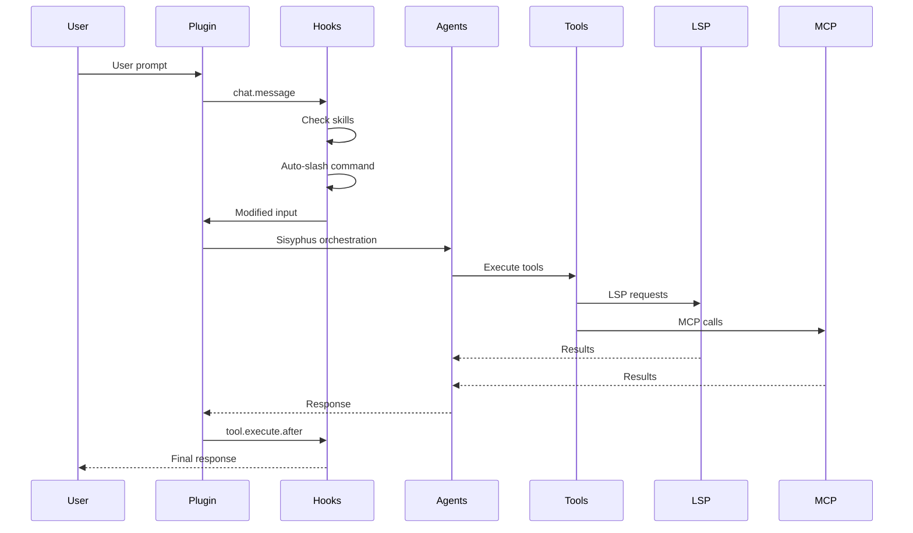
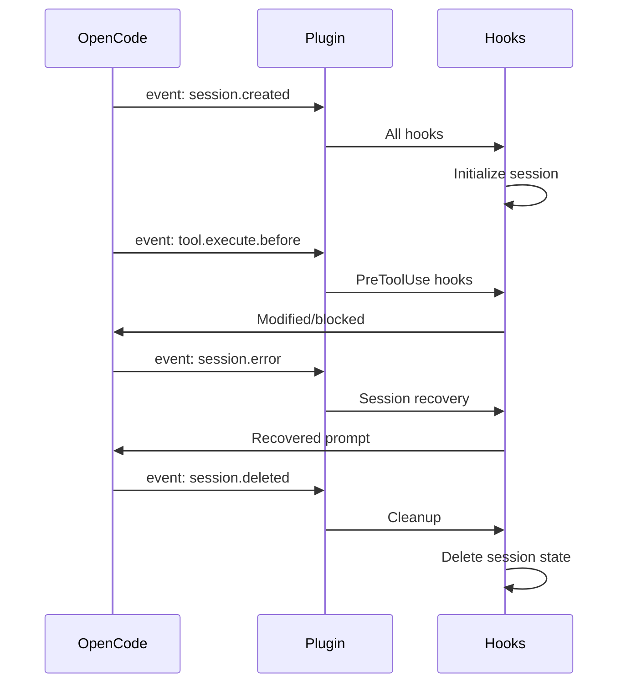

# Oh-My-OpenCode Complete Architecture Reference

**Generated:** 2026-01-05
**Branch:** feature/analyze-features
**Commit:** 65b00c9

---

## Executive Summary

Oh-My-OpenCode is a **multi-model AI agent orchestration plugin** for OpenCode CLI. It provides enterprise-grade tooling (LSP, AST-Grep), 7 specialized AI agents, 22 lifecycle hooks, and full Claude Code compatibility layer.

**Total Codebase:**
- **~30,000 lines** of TypeScript (excluding tests)
- **~10,000 lines** of tests
- **~200 files**
- **7 AI agents**, **22 hooks**, **20+ tools**

---

## Directory Structure

```
src/
├── index.ts                      # Main plugin entry (464 lines)
├── config/                       # Zod schema, types (296 lines)
│   ├── schema.ts                 # All config schemas
│   └── index.ts                  # Barrel export
├── agents/                       # 7 AI agents
│   ├── index.ts                  # Agent registry
│   ├── types.ts                  # Agent types
│   ├── sisyphus.ts              # Orchestrator (505 lines)
│   ├── sisyphus-prompt-builder.ts  # Dynamic prompts (333 lines)
│   ├── oracle.ts                 # Advisor (126 lines)
│   ├── librarian.ts               # Research (272 lines)
│   ├── explore.ts                # Grep (124 lines)
│   ├── frontend-ui-ux-engineer.ts  # UI/UX (110 lines)
│   ├── document-writer.ts         # Docs (225 lines)
│   ├── multimodal-looker.ts      # PDF/image (67 lines)
│   ├── utils.ts                  # Agent creation
│   └── utils.test.ts             # Tests
├── hooks/                        # 22 lifecycle hooks (~8,000 lines)
│   ├── index.ts                  # Barrel export
│   ├── todo-continuation-enforcer/    # Force TODO completion
│   ├── session-recovery/               # Recover from errors
│   ├── anthropic-context-window-limit-recovery/  # Auto-compact
│   ├── claude-code-hooks/              # settings.json hooks
│   ├── think-mode/                    # Auto-detect thinking
│   ├── ralph-loop/                    # Self-referential dev loop
│   ├── keyword-detector/               # Ultrawork/search activation
│   ├── rules-injector/                # Conditional rules
│   ├── auto-slash-command/            # /command detection
│   ├── preemptive-compaction/          # Pre-emptive at 85%
│   ├── comment-checker/                # Prevent AI comments
│   ├── tool-output-truncator/         # Truncate verbose output
│   ├── directory-agents-injector/       # Auto-inject AGENTS.md
│   ├── directory-readme-injector/       # Auto-inject README.md
│   ├── empty-task-response-detector/    # Detect empty responses
│   ├── background-notification/           # OS notify on complete
│   ├── auto-update-checker/            # Version notifications
│   ├── agent-usage-reminder/           # Remind to use specialists
│   ├── non-interactive-env/            # CI/headless handling
│   ├── interactive-bash-session/       # Tmux session mgmt
│   ├── empty-message-sanitizer/         # Sanitize empty messages
│   ├── thinking-block-validator/         # Validate thinking blocks
│   ├── context-window-monitor.ts        # Monitor usage (standalone)
│   ├── session-notification.ts          # OS notify on idle
│   └── edit-error-recovery/            # Recover from edit errors
├── tools/                        # Custom tools (~3,500 lines)
│   ├── index.ts                  # Tool registry
│   ├── lsp/                      # LSP client (611 lines)
│   ├── ast-grep/                 # AST search/replace
│   ├── background-task/            # Task management
│   ├── skill/                    # Skill execution
│   ├── skill-mcp/                # Skill MCP
│   ├── glob/                      # File pattern matching
│   ├── grep/                      # Content search
│   ├── slashcommand/               # Slash command execution
│   ├── session-manager/            # Session file ops
│   ├── look-at/                   # Multimodal analysis
│   ├── call-omo-agent/            # Spawn explore/librarian
│   └── interactive-bash/          # Tmux session
├── features/                     # Feature modules (~3,500 lines)
│   ├── background-agent/           # Task lifecycle (499 lines)
│   ├── builtin-commands/           # init-deep, ralph-loop
│   ├── builtin-skills/             # Playwright
│   ├── claude-code-agent-loader/   # ~/.claude/agents/*.md
│   ├── claude-code-command-loader/  # ~/.claude/commands/*.md (260 lines)
│   ├── claude-code-mcp-loader/     # .mcp.json (114 + 54 + 28)
│   ├── claude-code-plugin-loader/   # installed_plugins.json (487 lines)
│   ├── claude-code-session-state/   # Subagent session tracking
│   ├── context-injector/          # Context collection + injection
│   ├── hook-message-injector/      # Filesystem message injection
│   ├── opencode-skill-loader/      # Multi-source skills (458 lines)
│   ├── opencode-skill-loader/merger.ts  # Skill merge logic (268 lines)
│   └── skill-mcp-manager/         # MCP server management (317 lines)
├── shared/                       # Cross-cutting utilities (~2,500 lines)
│   ├── index.ts
│   ├── frontmatter.ts             # YAML frontmatter
│   ├── jsonc-parser.ts           # JSON with Comments
│   ├── deep-merge.ts              # Recursive merge
│   ├── dynamic-truncator.ts       # Token-aware truncation
│   ├── model-sanitizer.ts         # Normalize model names
│   ├── permission-compat.ts       # v1.1.1 compat
│   ├── migration.ts               # Legacy name compat
│   ├── file-utils.ts              # Symlink, markdown detection
│   ├── claude-config-dir.ts       # ~/.claude resolution
│   ├── opencode-config-dir.ts      # ~/.config/opencode resolution
│   ├── opencode-version.ts        # OpenCode version detection
│   ├── logger.ts                 # File-based logging
│   ├── command-executor.ts        # Shell exec with variable expansion
│   ├── config-path.ts             # User/project config paths
│   ├── data-path.ts               # XDG data directory
│   ├── file-reference-resolver.ts  # @filename syntax
│   ├── hook-disabled.ts           # Check if hook disabled
│   ├── config-errors.ts           # Global error tracking
│   ├── pattern-matcher.ts         # Tool name matching
│   ├── snake-case.ts              # Case conversion
│   └── tool-name.ts             # PascalCase normalization
├── config/                       # Zod schema (296 lines)
│   ├── schema.ts                 # All config schemas
│   └── index.ts
├── auth/                         # Google Antigravity OAuth (~100K lines)
│   └── antigravity/
│       ├── plugin.ts              # Main export, hooks
│       ├── oauth.ts               # OAuth flow (241 lines)
│       ├── token.ts               # Token storage (148 lines)
│       ├── fetch.ts               # Fetch interceptor (621 lines)
│       ├── response.ts            # SSE parsing (598 lines)
│       ├── thinking.ts            # Thinking block extraction (571 lines)
│       ├── thought-signature-store.ts  # Signature caching
│       ├── message-converter.ts    # Format conversion
│       ├── request.ts            # Request building
│       ├── project.ts            # Project ID management (262 lines)
│       ├── tools.ts              # OAuth tool registration
│       ├── constants.ts           # API endpoints, model mappings
│       └── types.ts              # Auth types
├── cli/                          # CLI tools (~2,000 lines)
│   ├── index.ts                  # Commander.js entry
│   ├── install.ts                # Interactive installer (477 lines)
│   ├── config-manager.ts         # JSONC parsing (669 lines)
│   ├── types.ts                  # CLI-specific types
│   ├── doctor/                   # Health checks
│   ├── get-local-version/         # Version detection
│   └── run/                      # Session launcher
├── mcp/                          # MCP configs (~200 lines)
│   ├── index.ts
│   ├── context7.ts               # context7 MCP config
│   ├── websearch-exa.ts          # websearch_exa MCP config
│   ├── grep-app.ts              # grep_app MCP config
│   └── types.ts                  # MCP types
├── plugin-config.ts              # Config loader
├── plugin-state.ts               # Model cache state
└── plugin-handlers.ts            # Config change handlers
```

---

## Module Deep Dive

### 1. src/config/ - Configuration Schema

**Purpose:** Zod schema for plugin configuration.

**Files:** 2 files, 296 lines

#### Key Schemas

| Schema | Purpose |
|--------|---------|
| `OhMyOpenCodeConfigSchema` | Main config root |
| `AgentOverridesSchema` | Agent-specific overrides |
| `AgentOverrideConfigSchema` | Individual agent override |
| `SisyphusAgentConfigSchema` | Sisyphus config |
| `RalphLoopConfigSchema` | Ralph loop config |
| `SkillsConfigSchema` | Skill sources + enable/disable |
| `SkillDefinitionSchema` | Individual skill config |
| `ExperimentalConfigSchema` | Experimental features |
| `ClaudeCodeConfigSchema` | Claude Code compatibility |
| `CommentCheckerConfigSchema` | Comment checker config |
| `DynamicContextPruningConfigSchema` | DCP strategies |
| `HookNameSchema` | All hook names (22) |
| `BuiltinAgentNameSchema` | All agent names (7) |
| `BuiltinSkillNameSchema` | All skill names (playwright) |
| `BuiltinCommandNameSchema` | All command names (init-deep) |
| `McpNameSchema` | All MCP names |
| `PermissionValue` | Permission enum (ask, allow, deny) |
| `BashPermission` | Bash permission (value or per-command record) |
| `AgentPermissionSchema` | Agent tool permissions |

#### Experimental Config

```typescript
export const ExperimentalConfigSchema = z.object({
  aggressive_truncation: z.boolean().optional(),
  auto_resume: z.boolean().optional(),
  preemptive_compaction: z.boolean().optional(),  // default: true since v2.9.0
  preemptive_compaction_threshold: z.number().min(0.5).max(0.95).optional(),
  truncate_all_tool_outputs: z.boolean().optional(),
  dcp_for_compaction: z.boolean().optional(),  // DCP for compaction
  dynamic_context_pruning: DynamicContextPruningConfigSchema.optional(),
})
```

#### Dynamic Context Pruning (DCP)

```typescript
export const DynamicContextPruningConfigSchema = z.object({
  enabled: z.boolean().default(false),
  notification: z.enum(["off", "minimal", "detailed"]).default("detailed"),
  turn_protection: z.object({
    enabled: z.boolean().default(true),
    turns: z.number().min(1).max(10).default(3),
  }).optional(),
  protected_tools: z.array(z.string()).default([
    "task", "todowrite", "todoread",
    "lsp_rename", "lsp_code_action_resolve",
    "session_read", "session_write", "session_search",
  ]),
  strategies: z.object({
    deduplication: z.object({ enabled: z.boolean().default(true) }).optional(),
    supersede_writes: z.object({
      enabled: z.boolean().default(true),
      aggressive: z.boolean().default(false),
    }).optional(),
    purge_errors: z.object({
      enabled: z.boolean().default(true),
      turns: z.number().min(1).max(20).default(5),
    }).optional(),
  }).optional(),
})
```

---

### 2. src/auth/ - Google Antigravity OAuth

**Purpose:** OAuth for Gemini models, token management, fetch interception, thinking block extraction.

**Files:** 14 files, ~100,000 lines

#### Key Components

| File | Purpose | Lines |
|------|---------|--------|
| `oauth.ts` | Browser-based OAuth flow | 241 |
| `token.ts` | Token storage, refresh logic | 148 |
| `fetch.ts` | URL rewriting, token injection, retries | 621 |
| `response.ts` | Streaming SSE parsing | 598 |
| `thinking.ts` | Thinking block extraction | 571 |
| `project.ts` | Project ID management | 262 |
| `tools.ts` | OAuth tool registration | 168 |
| `constants.ts` | API endpoints, model mappings | 94 |
| `types.ts` | Auth types | 171 |
| `message-converter.ts` | Format conversion | 138 |
| `request.ts` | Request building | 218 |
| `thought-signature-store.ts` | Signature caching | 87 |

#### How It Works

1. **Intercept**: `fetch.ts` intercepts Anthropic/Google requests
2. **Rewrite**: URLs → Antigravity proxy endpoints
3. **Auth**: Bearer token from stored OAuth credentials
4. **Response**: Streaming parsed via `response.ts`
5. **Extract**: `<antThinking>` blocks extracted via `thinking.ts`
6. **Transform**: Normalized for OpenCode

#### Features

- Multi-account (up to 10 Google accounts)
- Auto-fallback on rate limit
- Thinking blocks preserved
- Antigravity proxy for AI Studio access

---

### 3. src/cli/ - Command Line Interface

**Purpose:** Interactive installer, health diagnostics (doctor), runtime launcher.

**Files:** 9 files, ~2,000 lines

#### Commands

| Command | Purpose |
|---------|---------|
| `install` | Interactive setup wizard |
| `doctor` | Environment health checks |
| `run` | Launch OpenCode session |

#### Doctor Checks (17+ in `doctor/checks/`)

- `version.ts` - OpenCode >= 1.0.150
- `config.ts` - Plugin registered
- `bun.ts`, `node.ts`, `git.ts` - Runtime dependencies
- `anthropic-auth.ts`, `openai-auth.ts`, `google-auth.ts` - Auth checks
- `lsp-*.ts` - LSP server checks
- `mcp-*.ts` - MCP server checks

#### Config Manager (669 lines)

- JSONC support (comments, trailing commas)
- Multi-source: User (~/.config/opencode/) + Project (.opencode/)
- Zod validation
- Legacy format migration
- Error aggregation for doctor

---

### 4. src/mcp/ - MCP Configurations

**Purpose:** Builtin MCP server configurations.

**Files:** 5 files, ~200 lines

#### MCP Servers

| MCP | Purpose | URL |
|------|---------|------|
| `context7` | Library documentation | https://context7.com |
| `websearch_exa` | Web search | https://exa.ai |
| `grep_app` | GitHub code search | https://grep.app |

---

### 5. src/index.ts - Main Plugin Entry

**Purpose:** Plugin initialization, hook/tool registration, event handling.

**Lines:** 464 lines

#### Initialization Sequence

```typescript
const OhMyOpenCodePlugin: Plugin = async (ctx) => {
  // 1. Start background tmux check
  startTmuxCheck();

  // 2. Load plugin config
  const pluginConfig = loadPluginConfig(ctx.directory, ctx);

  // 3. Create hooks (respecting disabled_hooks)
  const disabledHooks = new Set(pluginConfig.disabled_hooks ?? []);
  const isHookEnabled = (hookName: HookName) => !disabledHooks.has(hookName);

  // 4. Initialize all hooks
  const contextWindowMonitor = isHookEnabled("context-window-monitor")
    ? createContextWindowMonitorHook(ctx) : null;
  const sessionRecovery = isHookEnabled("session-recovery")
    ? createSessionRecoveryHook(ctx, { experimental: pluginConfig.experimental }) : null;
  // ... (all 22 hooks)

  // 5. Create background manager
  const backgroundManager = new BackgroundManager(ctx);

  // 6. Discover skills
  const [userSkills, globalSkills, projectSkills, opencodeProjectSkills] = await Promise.all([
    discoverUserClaudeSkillsAsync(),
    discoverOpencodeGlobalSkillsAsync(),
    discoverProjectClaudeSkillsAsync(),
    discoverOpencodeProjectSkillsAsync(),
  ]);

  // 7. Merge skills with priority
  const mergedSkills = mergeSkills(builtinSkills, pluginConfig.skills, ...);

  // 8. Create skill MCP manager
  const skillMcpManager = new SkillMcpManager();

  // 9. Initialize Google auth
  const googleAuthHooks = pluginConfig.google_auth !== false
    ? await createGoogleAntigravityAuthPlugin(ctx) : null;

  // 10. Return plugin object
  return {
    ...(googleAuthHooks ? { auth: googleAuthHooks.auth } : {}),
    tool: { ...builtinTools, ...backgroundTools, skill, skill_mcp, ... },
    "chat.message": async (input, output) => { /* ralph-loop handling */ },
    "experimental.chat.messages.transform": async (input, output) => { /* context injection */ },
    config: configHandler,
    event: async (input) => { /* session.created, session.deleted, session.error */ },
    "tool.execute.before": async (input, output) => { /* pre-execution hooks */ },
    "tool.execute.after": async (input, output) => { /* post-execution hooks */ },
  };
};
```

---

## Complete Data Flow

### Request Flow



### Event Flow



---

## Configuration Priority

```
1. opencode.json (project-specific, highest priority)
2. oh-my-opencode.json (user-specific)
3. Defaults (hardcoded in plugin)
```

### Config Locations

| Type | Location |
|------|----------|
| User config | `~/.config/opencode/oh-my-opencode.json` |
| Project config | `.opencode/oh-my-opencode.json` |
| Claude Code | `~/.claude/settings.json` |
| Skills (user) | `~/.claude/skills/*.md` |
| Skills (project) | `.claude/skills/*.md` |
| Skills (opencode) | `~/.config/opencode/skills/` or `.opencode/skills/` |

---

## Complexity Hotspots (Final)

| File | Lines | Description | Complexity |
|------|-------|-------------|-------------|
| `src/index.ts` | 464 | Main plugin, all hook/tool init | High |
| `src/agents/sisyphus.ts` | 505 | Orchestrator prompt, dynamic sections | High |
| `src/agents/sisyphus-prompt-builder.ts` | 333 | Dynamic prompt sections | Medium |
| `src/tools/lsp/client.ts` | 611 | LSP protocol, JSON-RPC | High |
| `src/features/claude-code-plugin-loader/loader.ts` | 487 | Plugin orchestration | High |
| `src/features/background-agent/manager.ts` | 499 | Task lifecycle, polling | High |
| `src/hooks/anthropic-context-window-limit-recovery/executor.ts` | 564 | Multi-stage recovery | High |
| `src/hooks/ralph-loop/index.test.ts` | 655 | Comprehensive test coverage | High |
| `src/auth/antigravity/fetch.ts` | 621 | Fetch interceptor, retries | High |
| `src/auth/antigravity/response.ts` | 598 | SSE streaming parsing | High |
| `src/auth/antigravity/thinking.ts` | 571 | Thinking block extraction | High |
| `src/cli/config-manager.ts` | 669 | JSONC parsing, env detection | Medium |
| `src/hooks/todo-continuation-enforcer.ts` | 391 | Session tracking, countdown | Medium |
| `src/agents/librarian.ts` | 272 | OSS research workflow | Medium |

---

## Testing Strategy

### Test Coverage

| Module | Test Files | Approx Lines |
|---------|------------|--------------|
| agents/ | 1 | 147 |
| features/ | 30+ | 2,500+ |
| hooks/ | 15+ | 3,000+ |
| shared/ | 10+ | 1,000+ |
| tools/ | 5+ | 800+ |
| cli/ | 2+ | 200+ |
| config/ | - | - |

**Total:** ~7,800 lines of tests

### Test Patterns

```typescript
// BDD-style comments
#given
// ...setup

#when
// ...action

#then
// ...expectation
```

---

## Anti-Patterns

| Category | Forbidden | Reason |
|----------|-----------|--------|
| Type Safety | `as any`, `@ts-ignore`, `@ts-expect-error` | Breaks type system |
| Package Manager | npm, yarn, npx | Bun required |
| File Ops | Bash mkdir/touch/rm for code file creation | Use Write tool |
| Publishing | Direct `bun publish`, local version bump | GitHub Actions only |
| Agent Behavior | High temp (>0.3), broad tool access | Slower, more errors |
| Hooks | Heavy PreToolUse logic, blocking without reason | Slows every tool call |
| CLI | Blocking prompts in non-TTY, hardcoded paths | Poor UX |

---

## Deployment

### GitHub Actions Workflow

**Trigger:** `workflow_dispatch` only

**Process:**
1. Never modify `package.json` version locally
2. Commit & push to dev
3. Trigger: `gh workflow run publish -f bump=patch|minor|major`

**CI Behavior:**
- Auto-commits schema changes on master
- Maintains rolling `next` draft release on dev

---

## Extension Points

### Adding a New Hook

```typescript
// src/hooks/my-hook/index.ts
export function createMyHook(ctx: PluginInput, options?: any) {
  return {
    PreToolUse: async (input, output) => { /* ... */ },
    PostToolUse: async (input, output) => { /* ... */ },
    UserPromptSubmit: async (input, output) => { /* ... */ },
    Stop: async (input, output) => { /* ... */ },
    onSummarize: async (input, output) => { /* ... */ },
  };
}
```

### Adding a New Config Schema

```typescript
// src/config/schema.ts
export const MyFeatureConfigSchema = z.object({
  enabled: z.boolean().optional(),
  option: z.string().optional(),
});
```

---

## Summary

**Code Metrics:**
- **Total Files:** ~200 files
- **Total Lines:** ~30,000 lines (excluding tests)
- **Test Lines:** ~7,800 lines
- **Agents:** 7
- **Hooks:** 22
- **Tools:** 20+
- **Features:** 13
- **Shared Utilities:** 21
- **Config Schemas:** 10+
- **MCP Servers:** 3 builtin

**Architecture Principles:**
1. **Multi-Model Orchestration** - Claude Opus 4.5, GPT-5.2, Gemini 3, Grok
2. **Parallel-First** - Background agents, concurrent tool calls
3. **Dynamic Prompts** - Agent metadata drives prompt sections
4. **Hook-Based** - Cross-cutting concerns without code modification
5. **Lazy Initialization** - LSP servers, MCP connections
6. **Type Safety** - Zod schemas, no `any` escapes
7. **Configuration Driven** - Everything toggleable via config

**Key Strengths:**
- Modular design with clear boundaries
- Comprehensive test coverage
- Rich integration (Claude Code, OpenCode, MCP)
- Powerful orchestration (Sisyphus with dynamic prompts)
- Low-latency tooling (LSP, AST-Grep)
- Enterprise-grade auth (Google Antigravity OAuth)

**Documentation:**
- `AGENTS.md` per directory for developer guidance
- Inline TDD comments (#given, #when, #then)
- Type safety throughout
- Clear extension points

**See Also:**
- `docs/analyzed/20260105__features-architecture.md` - Features module deep dive
- `docs/analyzed/20260105__full-architecture.md` - High-level architecture
