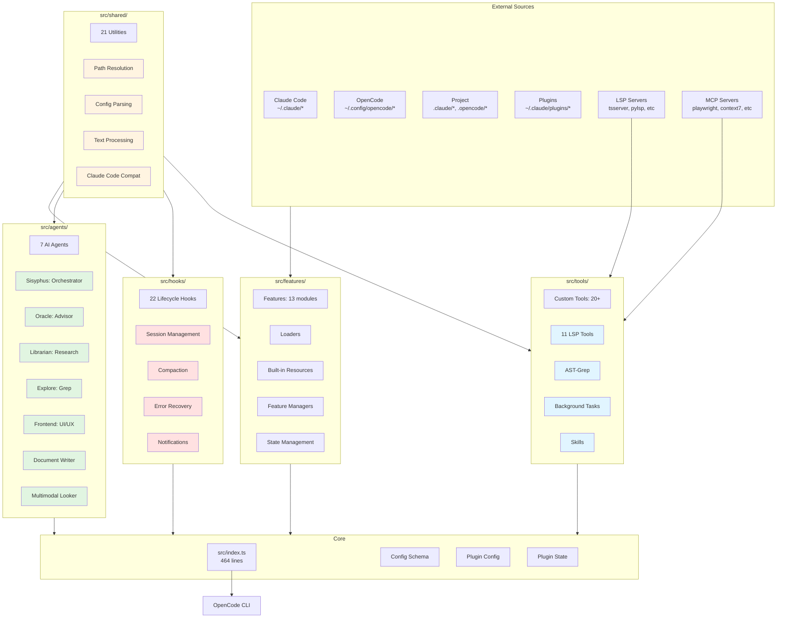
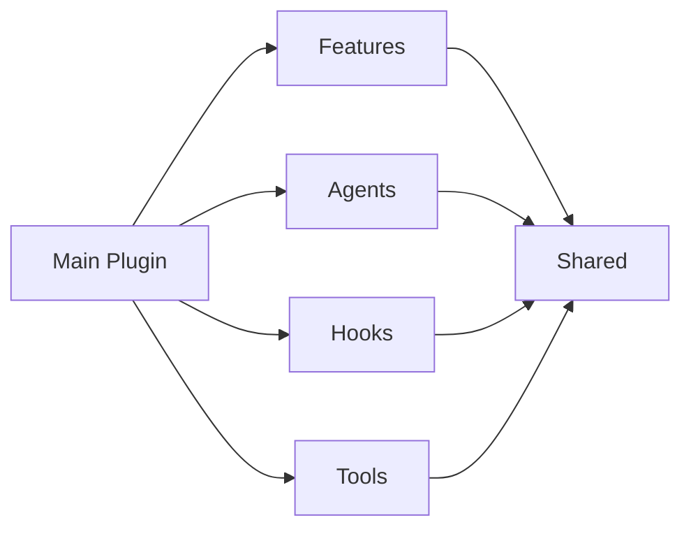
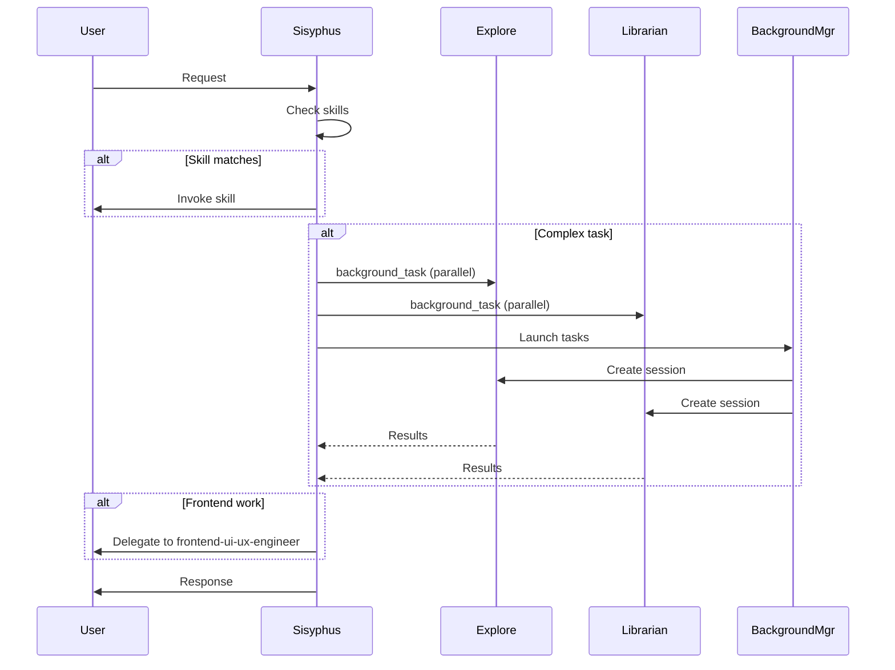
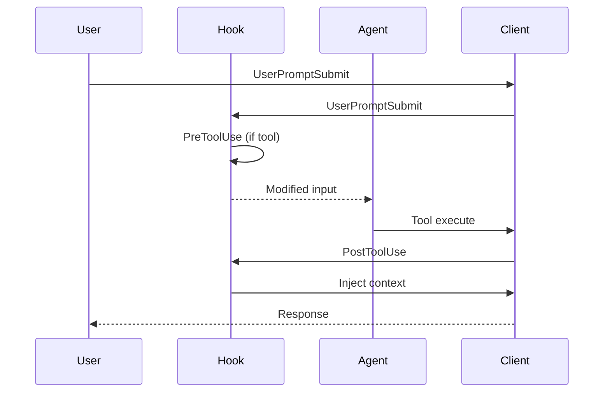
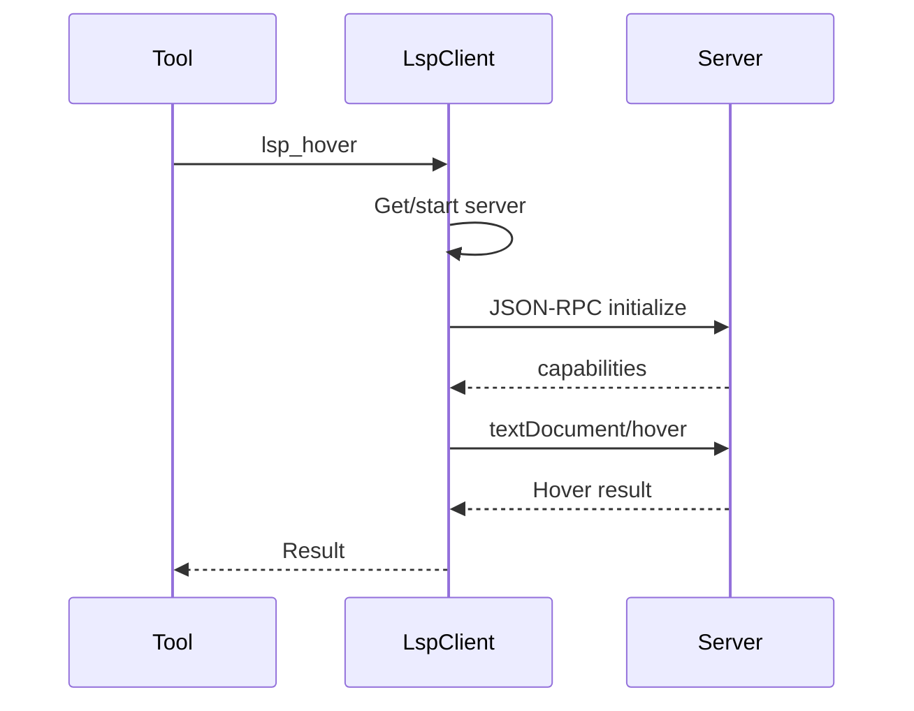

# Oh-My-OpenCode Full Architecture Analysis

**Generated:** 2026-01-05
**Branch:** feature/analyze-features
**Commit:** 65b00c9

---

## Overview

Oh-My-OpenCode is a multi-model agent orchestration plugin for OpenCode CLI. It provides 7 AI agents, 22 lifecycle hooks, 11 LSP tools, AST-Grep, and full Claude Code compatibility layer.

**Philosophy:** "oh-my-zsh" for OpenCode - orchestrating specialists, delegating strategically, and providing enterprise-grade tooling.

---

## High-Level Architecture



---

## Module Deep Dive

### 1. src/agents/ - AI Agent System

**Purpose:** 7 specialized AI agents with orchestration capabilities.

**Files:** 17 files, ~1,500 lines

#### Agent Registry (index.ts)

```typescript
export const builtinAgents: Record<string, AgentConfig> = {
  Sisyphus: sisyphusAgent,
  oracle: oracleAgent,
  librarian: librarianAgent,
  explore: exploreAgent,
  "frontend-ui-ux-engineer": frontendUiUxEngineerAgent,
  "document-writer": documentWriterAgent,
  "multimodal-looker": multimodalLookerAgent,
}
```

#### Agent Metadata Model (types.ts)

| Property | Description |
|----------|-------------|
| `AgentFactory` | `(model?: string) => AgentConfig` |
| `AgentCategory` | `"exploration" | "specialist" | "advisor" | "utility"` |
| `AgentCost` | `"FREE" | "CHEAP" | "EXPENSIVE"` |
| `DelegationTrigger` | `{ domain: string, trigger: string }` |
| `AgentPromptMetadata` | Category, cost, triggers, useWhen, avoidWhen, dedicatedSection, promptAlias, keyTrigger |

#### Primary Agents

| Agent | Model | Cost | Purpose | Lines |
|--------|-------|-------|---------|--------|
| **Sisyphus** | claude-opus-4-5 | - | Primary orchestrator, 505 lines |
| **oracle** | gpt-5.2 | EXPENSIVE | Architecture, code review | 126 lines |
| **librarian** | claude-sonnet-4-5 | CHEAP | OSS research, docs | 272 lines |
| **explore** | grok-code | FREE | Contextual grep | 124 lines |
| **frontend-ui-ux-engineer** | gemini-3-pro-preview | CHEAP | UI/UX design | 110 lines |
| **document-writer** | gemini-3-flash-preview | CHEAP | Technical documentation | 225 lines |
| **multimodal-looker** | gemini-3-flash | CHEAP | PDF/image analysis | 67 lines |

#### Sisyphus Orchestrator (sisyphus.ts)

**Dynamic Prompt Building:** Uses `sisyphus-prompt-builder.ts` (333 lines) to generate sections:

1. **Phase 0 - Intent Gate**
   - Key Triggers (skills + agents)
   - Step 0: Check Skills FIRST (BLOCKING)
   - Step 1: Classify Request Type
   - Step 2: Check for Ambiguity
   - Step 3: Validate Before Acting

2. **Phase 1 - Codebase Assessment**
   - Quick Assessment (config, samples, project age)
   - State Classification (disciplined, transitional, legacy/chaotic, greenfield)

3. **Phase 2A - Exploration & Research**
   - Tool Selection Table (by cost: FREE → CHEAP → EXPENSIVE)
   - Explore Agent Section
   - Librarian Agent Section
   - Parallel Execution Rules
   - Delegation Prompt Structure (7 sections MANDATORY)
   - GitHub Workflow (full cycle for @mentions)
   - Code Changes Guidelines

4. **Phase 2B - Implementation**
   - Pre-Implementation (todos, in_progress marking)

5. **Phase 2C - Failure Recovery**
   - After 3 consecutive failures: STOP, REVERT, DOCUMENT, CONSULT

6. **Phase 3 - Completion**
   - All todos complete, diagnostics clean, build passes
   - Cancel background tasks

7. **Task Management** (CRITICAL)
   - Mandatory todos for 2+ step tasks
   - Workflow: todowrite → mark in_progress → mark completed
   - Anti-patterns: skipping, batch-completing

8. **Tone and Style**
   - Concise, no flattery, no status updates
   - Match user's style

#### Agent Creation (utils.ts)

```typescript
export function createBuiltinAgents(
  disabledAgents: BuiltinAgentName[] = [],
  agentOverrides: AgentOverrides = {},
  directory?: string,
  systemDefaultModel?: string
): Record<string, AgentConfig>
```

- **Agent Sources:** Factory functions or static configs
- **Agent Metadata:** For Sisyphus prompt sections
- **Override Merging:** `deepMerge(base, override)`
- **Environment Context:** Time, timezone, locale for librarian

---

### 2. src/hooks/ - Lifecycle Hooks

**Purpose:** 22 hooks for intercepting/modifying agent behavior.

**Files:** 30+ files, ~8,000 lines

#### Hook Events

| Event | Timing | Can Block | Use Case |
|-------|----------|------------|-----------|
| `PreToolUse` | Before tool | ✅ | Validate, modify input |
| `PostToolUse` | After tool | ❌ | Add context, warnings |
| `UserPromptSubmit` | On prompt | ✅ | Inject messages, block |
| `Stop` | Session idle | ❌ | Inject follow-ups |
| `onSummarize` | Compaction | ❌ | Preserve context |

#### Key Hooks

| Hook | Purpose | Files | Lines |
|-------|---------|-------|--------|
| **todo-continuation-enforcer** | Force TODO completion on idle | todo-continuation-enforcer.ts, .test.ts | 391 + 165 |
| **session-recovery** | Recover from errors | index.ts, index.test.ts | 430 + 203 |
| **anthropic-context-window-limit-recovery** | Auto-compact at limit | index.ts, storage.ts, .test.ts | 564 + 123 |
| **claude-code-hooks** | settings.json hooks | index.ts | - |
| **session-notification** | OS notify on idle | session-notification.ts, .test.ts | 111 + 108 |
| **think-mode** | Auto-detect thinking triggers | index.ts, switcher.ts, .test.ts | - |
| **ralph-loop** | Self-referential dev loop | index.ts, storage.ts, .test.ts | 364 + 655 |
| **keyword-detector** | Ultrawork/search keyword activation | index.ts, constants.ts | - |
| **rules-injector** | Conditional rules from .claude/rules/ | index.ts, finder.ts, .test.ts, parser.test.ts | - |
| **auto-slash-command** | Detect and execute /command patterns | index.ts, detector.ts, .test.ts, executor.ts | 194 + 296 + 258 |
| **preemptive-compaction** | Pre-emptive at 85% usage | index.ts, .test.ts | - |

#### Hook Patterns

- **Storage:** JSON file for persistent state across sessions
- **Once-per-session:** Track injected paths in Set
- **Message injection:** Return `{ messages: [...] }`
- **Blocking:** Return `{ blocked: true, message: "..." }` from PreToolUse

---

### 3. src/tools/ - Custom Tool System

**Purpose:** 11 LSP tools, AST-aware search/replace, file ops with timeouts, background task management.

**Files:** 12 directories, ~3,500 lines

#### Tool Categories

| Category | Tools |
|----------|-------|
| **LSP** | lsp_hover, lsp_goto_definition, lsp_find_references, lsp_document_symbols, lsp_workspace_symbols, lsp_diagnostics, lsp_servers, lsp_prepare_rename, lsp_rename, lsp_code_actions, lsp_code_action_resolve |
| **AST** | ast_grep_search, ast_grep_replace |
| **File Search** | grep, glob |
| **Session** | session_list, session_read, session_search, session_info |
| **Background** | background_task, background_output, background_cancel |
| **Multimodal** | look_at |
| **Terminal** | interactive_bash |
| **Skills** | skill, skill_mcp |
| **Agents** | call_omo_agent |

#### LSP Client (lsp/client.ts - 611 lines)

```typescript
export class LspClient {
  private connections: Map<string, LspConnection>
  private serverConfigs: Map<string, LspServerConfig>

  async startServer(languageId: string, serverName?: string): Promise<void>
  async getHover(params: HoverParams): Promise<HoverResult>
  async gotoDefinition(params: DefinitionParams): Promise<Location>
  async findReferences(params: ReferencesParams): Promise<Location[]>
  async documentSymbols(params: DocumentSymbolsParams): Promise<Symbol[]>
  async workspaceSymbols(params: WorkspaceSymbolsParams): Promise<Symbol[]>
  async getDiagnostics(params: DiagnosticsParams): Promise<Diagnostic[]>
  async listServers(): Promise<ServerInfo[]>
  async prepareRename(params: PrepareRenameParams): Promise<PrepareRenameResult>
  async doRename(params: RenameParams): Promise<RenameResult>
  async codeActions(params: CodeActionsParams): Promise<CodeAction[]>
  async resolveCodeAction(params: CodeActionResolveParams): Promise<CodeAction>
}
```

**Features:**
- Lazy init on first use, auto-shutdown on idle
- Config priority: opencode.json > oh-my-opencode.json > defaults
- Server types: typescript-language-server, pylsp, gopls, rust-analyzer

#### AST-Grep (ast-grep/)

**Meta-variables:**
- `$VAR` - Single variable replacement
- `$$$` - Multiple variable replacement

**Languages Supported:** 25+ (TypeScript, JavaScript, Python, Go, Rust, etc.)

---

### 4. src/shared/ - Cross-Cutting Utilities

**Purpose:** Path resolution, config management, text processing, Claude Code compatibility helpers.

**Files:** 24 files, ~2,500 lines

#### Key Utilities

| Utility | Purpose | Files |
|----------|---------|--------|
| **frontmatter** | YAML frontmatter parsing | frontmatter.ts, .test.ts |
| **jsonc-parser** | JSON with Comments | jsonc-parser.ts, .test.ts |
| **deep-merge** | Type-safe recursive merge | deep-merge.ts |
| **dynamic-truncator** | Token-aware truncation | dynamic-truncator.ts |
| **model-sanitizer** | Normalize model names | model-sanitizer.ts |
| **permission-compat** | OpenCode v1.1.1 permission compatibility | permission-compat.ts, .test.ts |
| **migration** | Legacy name compat (omo → Sisyphus) | migration.ts, .test.ts |
| **file-utils** | Symlink, markdown detection | file-utils.ts |
| **claude-config-dir** | ~/.claude resolution | claude-config-dir.ts, .test.ts |
| **opencode-config-dir** | ~/.config/opencode resolution | opencode-config-dir.ts, .test.ts |
| **opencode-version** | OpenCode version detection | opencode-version.ts, .test.ts |
| **logger** | File-based logging | logger.ts |

#### Critical Patterns

```typescript
// Dynamic truncation
const output = dynamicTruncate(result, remainingTokens, 0.5)

// Deep merge priority
const final = deepMerge(deepMerge(defaults, userConfig), projectConfig)

// Safe JSONC
const { config, error } = parseJsoncSafe(content)
```

---

### 5. src/features/ - Feature Modules

**Purpose:** Claude Code compatibility layer + core feature modules.

**Analysis:** See `docs/analyzed/20260105__features-architecture.md`

**Summary:** 13 features organized into:
- Loaders (Claude Code + OpenCode)
- Built-in Resources
- Feature Managers
- State Management

---

## Dependency Flow

### Top-Level Dependencies



### Shared Dependency Hotspots

```
shared/frontmatter
├── agents/ (all agent frontmatter parsing)
├── features/ (skill/command/agent loaders)
└── config/ (skill config parsing)

shared/model-sanitizer
├── agents/ (agent model fields)
├── features/ (command/skill loaders)
└── tools/ (tool models)

shared/deep-merge
├── features/ (skill merger)
└── shared/ (agent config merging)

shared/permission-compat
├── agents/ (agent tool restrictions)
├── features/ (background agent)
└── hooks/ (various hooks)

shared/file-utils
├── features/ (loaders)
└── hooks/ (message injector)

shared/dynamic-truncator
├── hooks/ (output truncation)
└── agents/ (thinking blocks)
```

### Inter-Module Dependencies

```
features/background-agent
├── features/hook-message-injector (message delivery)
└── features/claude-code-session-state (subagent tracking)

features/skill-mcp-manager
└── features/claude-code-mcp-loader (config transformation)

features/claude-code-plugin-loader
├── features/claude-code-command-loader (types)
├── features/claude-code-mcp-loader (transformer, env-expander)
└── features/opencode-skill-loader (types)

hooks/todo-continuation-enforcer
├── features/background-agent (task management)
├── features/claude-code-session-state (session detection)
└── features/hook-message-injector (message injection)
```

---

## Data Flow

### Agent Orchestration Flow



### Hook Event Flow



### LSP Client Flow



---

## Configuration System

### Config Priority

```
1. opencode.json (project-specific, highest priority)
2. oh-my-opencode.json (user-specific)
3. Defaults (hardcoded in plugin)
```

### Config Schema (config/schema.ts)

**Key Sections:**

| Section | Purpose |
|---------|---------|
| `claude_code` | Claude Code compatibility toggles |
| `skills` | Skill sources, enable/disable lists |
| `hooks` | Hook configuration |
| `agents` | Agent overrides |

---

## Testing Strategy

### Test Coverage

| Module | Test Files | Approx Lines |
|---------|------------|--------------|
| agents/ | utils.test.ts | 147 |
| features/ | 30+ test files | 2,500+ |
| hooks/ | 15+ test files | 3,000+ |
| shared/ | 10+ test files | 1,000+ |
| tools/ | 5+ test files | 800+ |

**Total:** ~8,000 lines of tests

### Test Patterns

```typescript
// BDD-style comments
#given
// ...setup

#when
// ...action

#then
// ...expectation
```

---

## Complexity Hotspots

| File | Lines | Description | Complexity |
|------|-------|-------------|-------------|
| `src/index.ts` | 464 | Main plugin, all hook/tool init | High |
| `src/agents/sisyphus.ts` | 505 | Orchestrator prompt, dynamic sections | High |
| `src/agents/sisyphus-prompt-builder.ts` | 333 | Dynamic prompt sections | Medium |
| `src/tools/lsp/client.ts` | 611 | LSP protocol, JSON-RPC | High |
| `src/features/claude-code-plugin-loader/loader.ts` | 487 | Plugin orchestration | High |
| `src/features/background-agent/manager.ts` | 499 | Task lifecycle, polling | High |
| `src/hooks/anthropic-context-window-limit-recovery/executor.ts` | 564 | Multi-stage recovery | High |
| `src/hooks/ralph-loop/index.ts` | 364 | Loop state management | Medium |
| `src/hooks/ralph-loop/index.test.ts` | 655 | Comprehensive test coverage | High |
| `src/hooks/todo-continuation-enforcer.ts` | 391 | Session tracking, countdown | Medium |

---

## Key Design Decisions

### 1. Agent Specialization

**Rationale:** Different models for different tasks = better cost/quality tradeoff.

**Implementation:**
- **explore** (grok-code): FREE, fast grep
- **librarian** (claude-sonnet-4-5): CHEAP, OSS research
- **oracle** (gpt-5.2): EXPENSIVE, deep reasoning

### 2. Parallel First

**Rationale:** Background agents = no blocking on user experience.

**Implementation:**
```typescript
// Fire explore agents in parallel
background_task(agent="explore", prompt="X")
background_task(agent="explore", prompt="Y")
background_task(agent="librarian", prompt="Z")
// Collect results later with background_output
```

### 3. Dynamic Prompts

**Rationale:** Agent metadata drives Sisyphus prompt sections (add agent without updating prompt).

**Implementation:**
```typescript
export interface AgentPromptMetadata {
  category: AgentCategory
  cost: AgentCost
  triggers: DelegationTrigger[]
  useWhen?: string[]
  avoidWhen?: string[]
  dedicatedSection?: string
  promptAlias?: string
  keyTrigger?: string
}
```

### 4. Hook-Based Architecture

**Rationale:** Hooks allow cross-cutting concerns without modifying agent code.

**Implementation:**
```typescript
export interface PluginHook {
  PreToolUse?: (input: any, output: any) => Promise<{ blocked?: boolean, message?: string }>
  PostToolUse?: (input: any, output: any) => Promise<void>
  UserPromptSubmit?: (input: any, output: any) => Promise<void>
  // ...
}
```

### 5. Lazy Initialization

**Rationale:** LSP servers = heavy startup cost, initialize on first use.

**Implementation:**
```typescript
export class LspClient {
  private connections: Map<string, LspConnection>

  async getHover(params: HoverParams): Promise<HoverResult> {
    await this.ensureServer()
    // ...
  }
}
```

---

## Extension Points

### Adding a New Agent

1. Create `src/agents/my-agent.ts`:
```typescript
import type { AgentConfig } from "@opencode-ai/sdk"
import type { AgentPromptMetadata } from "./types"

export const MY_AGENT_PROMPT_METADATA: AgentPromptMetadata = {
  category: "specialist",
  cost: "CHEAP",
  // ...
}

export function createMyAgent(model?: string): AgentConfig {
  return {
    description: "My agent description",
    mode: "subagent",
    model: model || "anthropic/claude-sonnet-4-5",
    prompt: "System prompt...",
  }
}
```

2. Add to `src/agents/index.ts`:
```typescript
import { createMyAgent, MY_AGENT_PROMPT_METADATA } from "./my-agent"

export const builtinAgents = {
  // ...
  "my-agent": createMyAgent(),
}
```

### Adding a New Hook

1. Create `src/hooks/my-hook/` with:
   - `index.ts` (createMyHook factory)
   - `constants.ts`
   - `types.ts` (optional)

2. Return:
```typescript
export function createMyHook(ctx: PluginInput, options?: any) {
  return {
    PreToolUse: async (input, output) => { /* ... */ },
    PostToolUse: async (input, output) => { /* ... */ },
    // ...
  }
}
```

3. Export from `src/hooks/index.ts`

### Adding a New Tool

1. Create `src/tools/my-tool/` with:
   - `constants.ts`
   - `types.ts`
   - `tools.ts`

2. Add to `src/tools/index.ts`:
```typescript
import { myTool } from "./my-tool"

export const builtinTools = {
  // ...
  myTool,
}
```

---

## Anti-Patterns

| Category | Forbidden | Reason |
|----------|-----------|--------|
| Type Safety | `as any`, `@ts-ignore`, `@ts-expect-error` | Breaks type system |
| Package Manager | npm, yarn, npx | Bun required |
| File Ops | Bash mkdir/touch/rm for code file creation | Use Write tool |
| Publishing | Direct `bun publish`, local version bump | GitHub Actions only |
| Agent Behavior | High temp (>0.3), broad tool access | Slower, more errors |
| Hooks | Heavy PreToolUse logic, blocking without reason | Slows every tool call |
| LSP | Ignoring LSP errors, no timeout | Poor UX |

---

## Performance Characteristics

### Token Usage Strategy

```
Sisyphus: maxTokens=64000, thinking=32000 (large context)
oracle: reasoningEffort=medium (high quality)
explore: temp=0.1 (fast, cheap)
librarian: temp=0.1 (balanced cost/speed)
```

### Parallelism

- **Background agents:** 3-5 concurrent spawns
- **LSP requests:** Multiple in parallel where independent
- **File operations:** Async with 60s timeout

### Timeout Strategy

```
grep: 60s
glob: 60s
LSP: Graceful error handling (no hard timeout)
ast_grep: napi binding (fast)
```

---

## Deployment

### GitHub Actions Workflow

**Trigger:** `workflow_dispatch` only

**Process:**
1. Never modify `package.json` version locally
2. Commit & push to dev
3. Trigger: `gh workflow run publish -f bump=patch|minor|major`

**CI Behavior:**
- Auto-commits schema changes on master
- Maintains rolling `next` draft release on dev

---

## File Index

```
src/
├── index.ts                    # Main plugin (464 lines)
├── agents/                     # 7 AI agents
│   ├── index.ts               # Agent registry
│   ├── types.ts               # Agent types
│   ├── sisyphus.ts           # Orchestrator (505 lines)
│   ├── sisyphus-prompt-builder.ts  # Dynamic prompts (333 lines)
│   ├── oracle.ts              # Advisor (126 lines)
│   ├── librarian.ts            # Research (272 lines)
│   ├── explore.ts             # Grep (124 lines)
│   ├── frontend-ui-ux-engineer.ts  # UI/UX (110 lines)
│   ├── document-writer.ts      # Docs (225 lines)
│   ├── multimodal-looker.ts   # PDF/image (67 lines)
│   ├── utils.ts               # Agent creation (147 lines)
│   └── utils.test.ts          # Tests
├── hooks/                      # 22 lifecycle hooks
│   ├── index.ts               # Barrel export
│   ├── todo-continuation-enforcer/
│   ├── session-recovery/
│   ├── anthropic-context-window-limit-recovery/
│   ├── claude-code-hooks/
│   ├── think-mode/
│   ├── ralph-loop/
│   ├── keyword-detector/
│   ├── rules-injector/
│   ├── auto-slash-command/
│   ├── preemptive-compaction/
│   └── ... (15+ more hooks)
├── tools/                      # Custom tools
│   ├── index.ts               # Tool registry
│   ├── lsp/                   # LSP client (611 lines)
│   ├── ast-grep/              # AST search
│   ├── background-task/         # Task management
│   ├── skill/                 # Skill execution
│   ├── skill-mcp/             # Skill MCP
│   └── ... (5+ more tool dirs)
├── features/                   # Feature modules
│   ├── background-agent/
│   ├── builtin-commands/
│   ├── builtin-skills/
│   ├── claude-code-agent-loader/
│   ├── claude-code-command-loader/
│   ├── claude-code-mcp-loader/
│   ├── claude-code-plugin-loader/
│   ├── claude-code-session-state/
│   ├── context-injector/
│   ├── hook-message-injector/
│   ├── opencode-skill-loader/
│   └── skill-mcp-manager/
├── shared/                     # Cross-cutting utilities
│   ├── frontmatter.ts
│   ├── jsonc-parser.ts
│   ├── deep-merge.ts
│   ├── dynamic-truncator.ts
│   ├── model-sanitizer.ts
│   ├── permission-compat.ts
│   ├── migration.ts
│   └── ... (15+ more utilities)
├── config/                     # Zod schema
│   ├── schema.ts
│   └── types.ts
├── auth/                       # OAuth
│   └── antigravity/
├── cli/                        # CLI tools
│   ├── config-manager.ts (669 lines)
│   ├── doctor/
│   └── ...
└── plugin-*.ts                # Plugin setup
```

---

## Summary

**Metrics:**
- **Total Files:** ~150 files
- **Total Lines:** ~20,000 lines (excluding tests)
- **Test Lines:** ~8,000 lines
- **Agents:** 7
- **Hooks:** 22
- **Tools:** 20+
- **Features:** 13
- **Shared Utilities:** 21

**Core Philosophy:**
- Multi-model orchestration (Claude Opus 4.5, GPT-5.2, Gemini 3, Grok)
- Parallel-first execution
- Claude Code compatibility layer
- Enterprise-grade tooling (LSP, AST-Grep)
- Extensible architecture (agents, hooks, tools)

**Key Strengths:**
- Modular design with clear boundaries
- Comprehensive test coverage
- Rich integration (Claude Code, OpenCode, MCP)
- Powerful orchestration (Sisyphus with dynamic prompts)
- Low-latency tooling (LSP, AST-Grep)

**Documentation:**
- `AGENTS.md` per directory for developer guidance
- Inline TDD comments (#given, #when, #then)
- Type safety throughout
- Clear extension points
