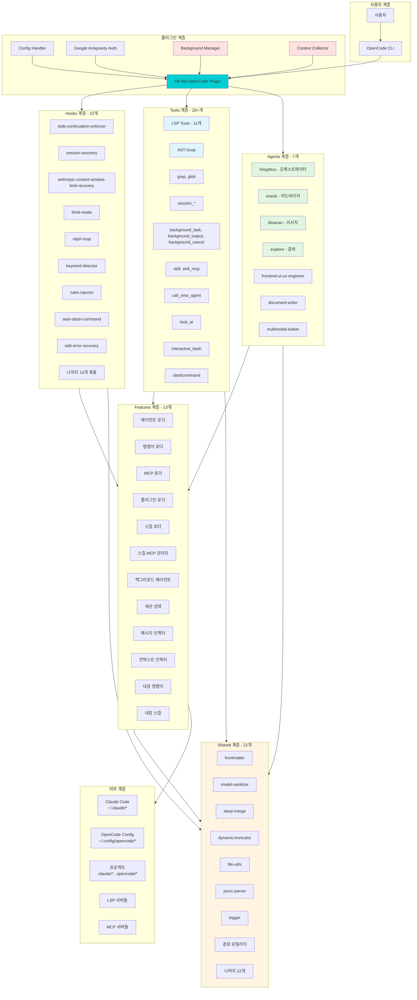
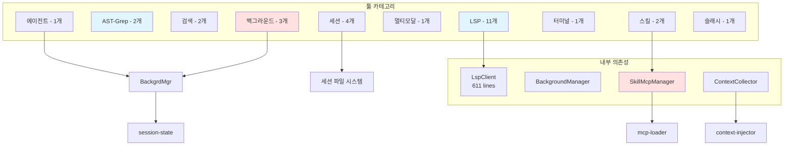
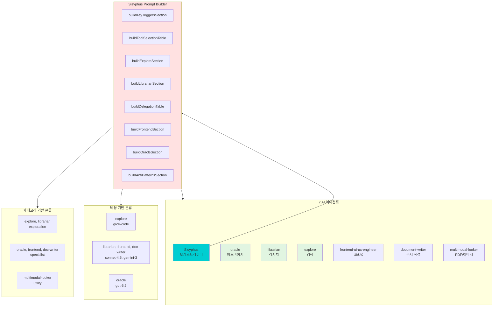
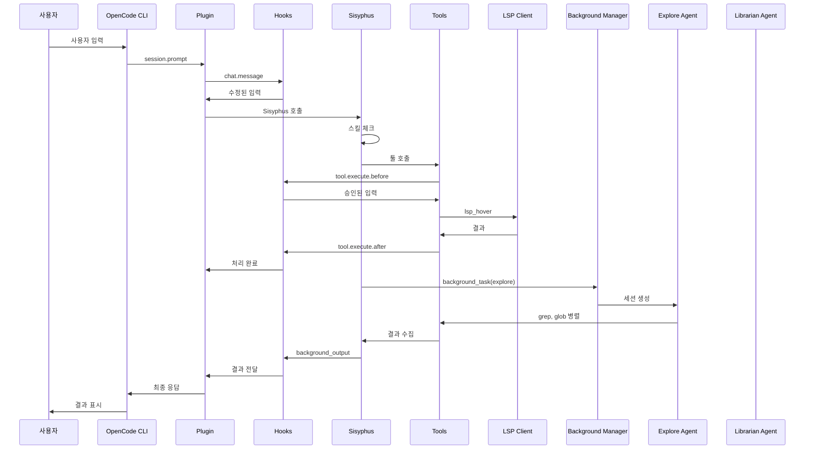
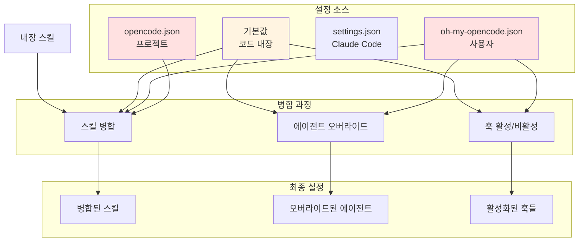

# Oh-My-OpenCode 기능 관계도

**Generated:** 2026-01-05
**Branch:** feature/analyze-features
**Commit:** 65b00c9

---

## 전체 아키텍처



---

## Hooks 기능 관계

```mermaid
graph TB
    subgraph Events[OpenCode 이벤트]
        ChatMsg[chat.message]
        MsgsTrans[experimental.chat.messages.transform]
        ConfigEv[config]
        EventEv[event]
        ToolBefore[tool.execute.before]
        ToolAfter[tool.execute.after]
    end

    subgraph Hooks[훅들]
        TodoHook[todo-continuation-enforcer]
        CtxWinHook[context-window-monitor]
        SessionRecoHook[session-recovery]
        ThinkHook[think-mode]
        RalphHook[ralph-loop]
        KeywordHook[keyword-detector]
        AutoSlashHook[auto-slash-command]
        EditRecoHook[edit-error-recovery]
    end

    subgraph Outputs[처리 결과]
        ModifiedInput[수정된 입력]
        Blocked[차단됨]
        SyntheticMsg[합성 메시지]
        RecoveryPrompt[복구 프롬프트]
        Countdown[카운트다운 토스트]
    end

    ChatMsg --> TodoHook
    ChatMsg --> RalphHook
    ChatMsg --> KeywordHook

    MsgsTrans --> CtxInjectMsg[context-injector/messages-transform]
    MsgsTrans --> ThinkBlockVal[thinking-block-validator]
    MsgsTrans --> EmptyMsgSan[empty-message-sanitizer]

    ConfigEv --> ConfigHandler[config-handler]

    EventEv --> AutoUpdateHook[auto-update-checker]
    EventEv --> BgNotifHook[background-notification]
    EventEv --> SessionNotifHook[session-notification]
    EventEv --> TodoHook
    EventEv --> CtxWinHook

    ToolBefore --> TodoHook
    ToolBefore --> SessionRecoHook
    ToolBefore --> CommentCheck[comment-checker]
    ToolBefore --> NonIntEnv[non-interactive-env]
    ToolBefore --> AutoSlashHook

    ToolAfter --> CtxWinHook
    ToolAfter --> ToolTrunc[tool-output-truncator]
    ToolAfter --> CommentCheck
    ToolAfter --> EmptyTaskResp[empty-task-response-detector]
    ToolAfter --> AgentReminder[agent-usage-reminder]
    ToolAfter --> InteractiveBash[interactive-bash-session]
    ToolAfter --> EditRecoHook

    style TodoHook fill:#ffe1e1
    style SessionRecoHook fill:#ffe1e1
    style CtxWinHook fill:#ffe1e1
    style RalphHook fill:#ffe1e1
    style ThinkHook fill:#ffe1e1
```



---

## Tools 기능 관계



---

## Agents 기능 관계



---

## Features 기능 관계

```mermaid
graph TB
    subgraph Loaders[로더 계층]
        AgentLoader[claude-code-agent-loader]
        CmdLoader[claude-code-command-loader]
        McpLoader[claude-code-mcp-loader]
        PluginLoader[claude-code-plugin-loader]
        SkillLoader[opencode-skill-loader]
    end

    subgraph Managers[관리자 계층]
        BackgrdMgr[background-agent<br/>TaskLifecycle]
        SkillMCPMgr[skill-mcp-manager<br/>MCPConnections]
        SkillMerger[opencode-skill-loader/merger<br/>SkillMerge]
    end

    subgraph State[상태 관리]
        SessionState[claude-code-session-state<br/>subagentSessions]
        MsgInjector[hook-message-injector<br/>FileSystem]
        CtxColl[context-injector/collector<br/>ContextCollector]
        CtxInj[context-injector/injector<br/>MessagesTransform]
    end

    subgraph Builtins[내장 리소스]
        BuiltinCmds[builtin-commands<br/>init-deep, ralph-loop]
        BuiltinSkills[builtin-skills<br/>playwright]
    end

    subgraph Shared[공통 유틸리티]
        Frontmatter[frontmatter]
        ModelSan[model-sanitizer]
        EnvExpand[env-expander]
        FileUtil[file-utils]
        DeepMerge[deep-merge]
        Logger[logger]
    end

    AgentLoader --> Frontmatter
    AgentLoader --> FileUtil
    CmdLoader --> Frontmatter
    CmdLoader --> ModelSan
    CmdLoader --> FileUtil
    McpLoader --> EnvExpand
    PluginLoader --> Frontmatter
    PluginLoader --> ModelSan
    PluginLoader --> FileUtil
    PluginLoader --> DeepMerge
    PluginLoader --> McpLoader
    PluginLoader --> CmdLoader
    PluginLoader --> SkillLoader

    SkillLoader --> Frontmatter
    SkillLoader --> ModelSan
    SkillLoader --> FileUtil
    SkillLoader --> DeepMerge
    SkillMerger --> DeepMerge
    SkillMerger --> Frontmatter

    BuiltinCmds --> SkillMerger
    BuiltinSkills --> SkillMerger

    BackgrdMgr --> SessionState
    BackgrdMgr --> MsgInjector
    BackgrdMgr --> Logger

    SkillMCPMgr --> McpLoader
    SkillMCPMgr --> EnvCleaner[env-cleaner]

    style AgentLoader fill:#e1f5e1
    style CmdLoader fill:#e1f5e1
    style McpLoader fill:#e1f5e1
    style PluginLoader fill:#e1f5e1
    style SkillLoader fill:#e1f5e1
    style BackgrdMgr fill:#e1f5ff
    style SkillMCPMgr fill:#e1f5ff
    style SessionState fill:#ffe1e1
    style MsgInjector fill:#ffe1e1
    style CtxColl fill:#ffe1e1
    style Shared fill:#fff4e1
```



---

## 데이터 흐름



---

## 설정 우선순위 흐름



---

## OpenCode Plugin 컴포넌트

### 1. Tools (도구)

| 카테고리 | 툴 | 설명 |
|-----------|------|------|
| **LSP (11개)** | `lsp_hover`, `lsp_goto_definition`, `lsp_find_references`, `lsp_document_symbols`, `lsp_workspace_symbols`, `lsp_diagnostics`, `lsp_servers`, `lsp_prepare_rename`, `lsp_rename`, `lsp_code_actions`, `lsp_code_action_resolve` | 코드 네비게이션, 정의, 참조 찾기 |
| **AST** | `ast_grep_search`, `ast_grep_replace` | 구조 기반 검색/치환 |
| **파일 검색** | `grep`, `glob` | 텍스트 검색, 파일 패턴 매칭 |
| **세션 관리** | `session_list`, `session_read`, `session_search`, `session_info` | 세션 파일 읽기/검색 |
| **에이전트** | `call_omo_agent` | explore/librarian 서브에이전트 호출 |
| **멀티모달** | `look_at` | PDF/이미지 분석 |
| **스킬** | `skill`, `skill_mcp` | 스킬 실행, 스킬 MCP 호출 |
| **터미널** | `interactive_bash` | Tmux 세션 관리 |
| **슬래시 명령** | `slashcommand` | /command 실행 |
| **백그라운드** | `background_task`, `background_output`, `background_cancel` | 비동기 태스크 관리 |

**총 20+ 툴 제공**

---

### 2. Hooks (이벤트 핸들러)

| 훅 | 타이밍 | 용도 |
|-----|---------|------|
| `chat.message` | 채팅 메시지 | ralph-loop, context-injection 처리 |
| `experimental.chat.messages.transform` | 메시지 변환 | synthetic message 주입 |
| `config` | 설정 변경 | config-handler로 처리 |
| `event` | 세션 이벤트 | session.created, session.deleted, session.error 등 |
| `tool.execute.before` | 툴 실행 전 | 유효성 검사, 입력 수정 |
| `tool.execute.after` | 툴 실행 후 | 결과 처리, 컨텍스트 추가 |

**총 6개 메인 훅 포인트 제공**

---

### 3. Auth (인증)

Google Antigravity OAuth 제공:

```typescript
auth: googleAuthHooks.auth  // Bearer token injection
```

**기능:**
- Gemini 모델용 OAuth 플로우
- 자동 토큰 갱신
- 다중 계정 지원 (최대 10개)
- Thinking block 보존

---

### 4. Config Handler

설정 변경 처리:

```typescript
config: configHandler
```

**기능:**
- `oh-my-opencode.json` 변경 감지
- 리얼타임 설정 업데이트
- hook/agent/tool 활성화 비활성화

---

### 5. Background Manager

백그라운드 태스크 관리 (OpenCode에 직접 노출되지 않지만 internal):

```typescript
const backgroundManager = new BackgroundManager(ctx)
```

**기능:**
- `background_task`로 세션 생성
- `background_output`로 결과 수집
- `background_cancel`로 취소
- TTL 정리 (30분)

---

### 6. Context Collector

컨텍스트 수집 및 주입 (internal):

```typescript
contextCollector = new ContextCollector()
contextInjector = createContextInjectorHook(contextCollector)
```

**기능:**
- `experimental.chat.messages.transform` 훅으로 컨텍스트 주입
- 우선순위 기반 정렬 (critical > high > normal > low)

---

## 사용자 관점에서 활용 가능한 기능

OpenCode CLI에서 다음 기능들을 사용할 수 있습니다:

### 1. 자동화된 스킬 실행
```
/skill playwright
/skill init-deep
```

### 2. LSP 기반 코드 네비게이션
```
lsp_hover 파일경로 라인
lsp_goto_definition 파일경로 라인
lsp_find_references 파일경로 라인
```

### 3. 백그라운드 연구
```
background_task(agent="explore", prompt="X구조 파악")
background_task(agent="librarian", prompt="라이브러리 레퍼런스")
// 나중에 수집
background_output(task_id="...")
```

### 4. AST 기반 리팩토링
```
ast_grep_search(pattern="function $NAME($$)", language=typescript)
ast_grep_replace(pattern="...", replacement="...", language=typescript)
```

### 5. 세션 이력 검색
```
session_search(query="auth implementation")
session_read(session_id="...")
```

### 6. Ralph Loop (반복 개발)
```
/ralph-loop "버그 수정"
/cancel-ralph
```

---

## 요약

| 구분 | 제공 항목 | 수량 |
|--------|------------|------|
| Tools | LSP, AST, 검색, 세션, 에이전트, 스킬, 터미널 | 20+ |
| Hooks | chat.message, messages.transform, tool.execute, config, event | 6개 포인트 |
| Auth | Google Antigravity OAuth | 1개 |
| Config | 실시간 설정 변경 감지 | 1개 |
| Internal | BackgroundManager, ContextCollector | 2개 |

OpenCode 사용자는 이 플러그인을 통해 **엔터프라이즈급 개발 도구 세트**와 **다중 모델 오케스트레이션**을 활용할 수 있습니다.

---

## 범례

| 색상 | 카테고리 |
|--------|----------|
| 🟢 #00CED1 | Sisyphus (오케스트레이터) |
| 🟢 #e1f5e1 | Agents (AI 에이전트들) |
| 🔵 #e1f5ff | Tools (도구들) |
| 🔴 #ffe1e1 | Hooks (훅들), Features (기능들) |
| 🟡 #fff4e1 | Shared (공통 유틸리티) |
